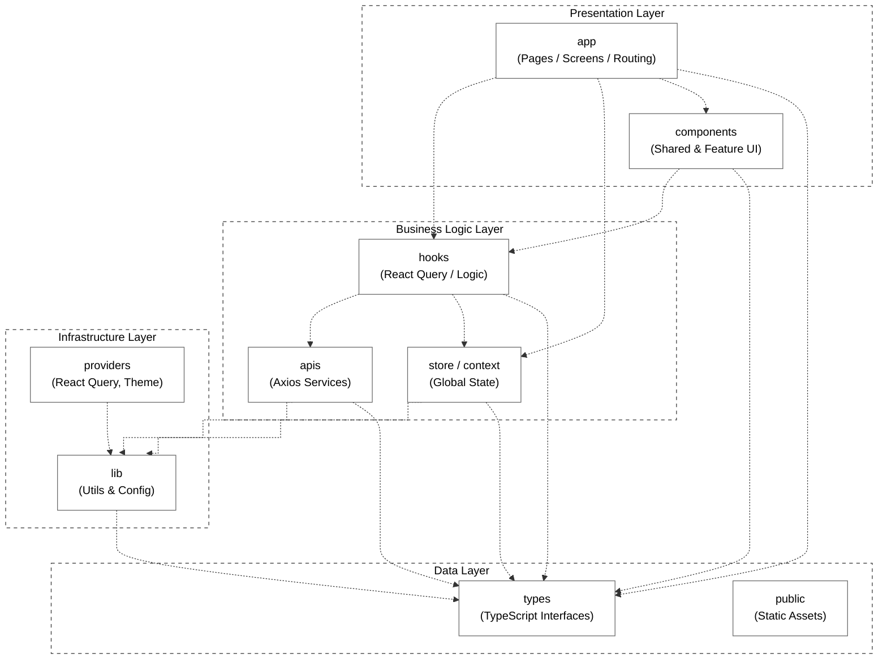

# Hướng dẫn vẽ Front-end Package Diagram cho SAGA

Dựa trên mẫu bạn cung cấp (Mô hình phân tầng - Layered Architecture), dự án **SAGA Frontend** của chúng ta cũng có thể được ánh xạ chuẩn xác vào các Tầng (Layers) này. Dưới đây là hướng dẫn cách phân tích cấu trúc dự án hiện tại và code Mermaid để bạn sinh ra biểu đồ.

## 1. Phân tích Ánh xạ (Mapping) Cấu trúc SAGA vào các Layer

Dựa theo mẫu trên ảnh, hệ thống chia làm 4 layer chính. Cấu trúc thư mục `src/` của SAGA sẽ được xếp vào như sau:

1. **Presentation Layer (Tầng Giao diện):** Nơi chứa các UI Components, layout và pages.
   - `app/`: Chứa các Pages và Layout routing của Next.js (Screens).
   - `components/`: Chứa các UI components dùng chung (Shared/UI components).
   - `features/**/components/`: Chứa các components đặc thù của từng chức năng (VD: `project-task-list`).

2. **Business Logic Layer (Tầng Nghiệp vụ):** Nơi xử lý logic, gọi API và quản lý state.
   - `features/**/hooks/`: Custom hooks (React Query) xử lý logic lấy và cập nhật dữ liệu.
   - `features/**/api/`: Các file định nghĩa gọi API bằng Axios (VD: `projectApi.ts`, `traceabilityApi.ts`).
   - `stores/` & `context/`: Quản lý Global State (Zustand/Context API).

3. **Infrastructure Layer (Tầng Hạ tầng):** Các thiết lập kết nối, cấu hình thư viện lõi.
   - `lib/`: Các tiện ích cấu hình core (VD: `axios.ts` instance, hàm tiện ích `utils.ts`).
   - `config/`: Cấu hình hệ thống chung.
   - `providers/` (nếu có, hoặc nằm trong context): Bọc ứng dụng với React Query Provider, Theme Provider.

4. **Data Layer (Tầng Dữ liệu):** Chứa định nghĩa kiểu dữ liệu và tài nguyên tĩnh.
   - `types/` & `features/**/types/`: Chứa các TypeScript Interfaces/Types định nghĩa mô hình dữ liệu.
   - `mock-data/`: Dữ liệu giả lập phục vụ test UI.
   - `public/` (Nằm ngoài src): Tài nguyên tĩnh như hình ảnh, fonts, icons.

---

## 2. Cách vẽ Biểu đồ bằng Mermaid (Diagram as Code)

Bạn không cần tốn thời gian kéo thả trên Draw.io. Bạn có thể sử dụng công cụ **Mermaid** (được hỗ trợ sẵn trên GitHub, Notion, và file Markdown của các IDE) để render trực tiếp thành hình ảnh.

Dưới đây là đoạn code Mermaid mô phỏng lại *chính xác* mô hình trong ảnh của bạn nhưng đã được tùy chỉnh cho đúng với thư mục thực tế của SAGA Frontend:

### Cách sử dụng đoạn code trên:
1. Bạn chỉ cần **Copy đoạn code trong khối `mermaid`** ở trên.
2. Dán vào trang [Mermaid Live Editor](https://mermaid.live/) để xem và tải về dạng ảnh `PNG` / `SVG`.
3. Hoặc bạn dán trực tiếp đoạn markdown này vào file README.md trên GitHub, GitHub sẽ tự động render ra biểu đồ.

## 3. Cách vẽ thủ công bằng Draw.io
Nếu bạn bắt buộc phải nộp file thiết kế bằng **Draw.io**, hãy làm theo các bước sau:
1. Mở [app.diagrams.net](https://app.diagrams.net/).
2. Chọn công cụ **UML** ở thanh menu bên trái.
3. Kéo khối **Package** (hình thư mục có tab nhỏ phía trên) ra màn hình, đổi tên thành `app`, `components`, `hooks`,...
4. Dùng khối **Rectangle (Hình chữ nhật)**, chỉnh viền nét đứt (`Dashed line`) và để nền rỗng (`No fill`) để bọc các Package lại tạo thành các Layer (Presentation Layer, Business Logic Layer,...).
5. Cuối cùng, dùng mũi tên nét đứt (`Dashed Arrow`) nối từ trên xuống dưới (để thể hiện sự phụ thuộc - Dependency). Tầng trên sẽ trỏ mũi tên xuống tầng dưới nó.

---

## 4. Package Descriptions (Mô tả các thành phần)

Dưới đây là bảng mô tả chi tiết chức năng của từng package trong dự án SAGA Frontend, được đánh số thứ tự liền mạch để bạn có thể copy trực tiếp vào file báo cáo đồ án.

### 🇬🇧 Phiên bản Tiếng Anh

| No | Package | Description |
|:---|:---|:---|
| 01 | **app** | This package contains the screens or pages, where UI components and logic are combined to create the user interface and app functionality. |
| 02 | **components** | This package contains reusable UI components and building blocks. |
| 03 | **hooks** | This package contains custom functions that encapsulate reusable logic, such as state management, API calls, or other shared functionality. |
| 04 | **apis** | This package contains API calling endpoints to interact with the server. |
| 05 | **store** | This package contains global states to manage data such as user login information, language configuration, etc. |
| 06 | **lib** | This package contains utility functions and helper methods that provide reusable logic for common tasks, such as data formatting, validation, API handling, and other non-UI-related operations. |
| 07 | **providers** | This package contains application providers such as React Query Provider, Theme Provider, and Socket Provider. |
| 08 | **events** | This package contains event names definitions and listeners for web socket or event bus handling. |
| 09 | **types** | This package contains TypeScript interfaces and type definitions used across the application. |
| 10 | **public** | This package contains static resources such as images, fonts, icons, and other media files. |

### 🇻🇳 Phiên bản Tiếng Việt

| STT | Tên Package | Mô tả chi tiết |
|:---|:---|:---|
| 01 | **app** | Chứa các màn hình (screens/pages), nơi kết hợp các UI Component và logic để tạo thành giao diện người dùng và chức năng hoàn chỉnh của ứng dụng. |
| 02 | **components** | Chứa các thành phần giao diện (UI components) dùng chung và có thể tái sử dụng. |
| 03 | **hooks** | Chứa các custom hooks đóng gói các logic xử lý chung như quản lý state, gọi API, v.v. |
| 04 | **apis** | Chứa các file định nghĩa endpoint gọi API để giao tiếp với hệ thống Server. |
| 05 | **store** | Quản lý các trạng thái toàn cục (global state) của ứng dụng như thông tin đăng nhập, cấu hình ngôn ngữ, v.v. |
| 06 | **lib** | Chứa các hàm tiện ích (utility functions) xử lý các tác vụ phổ biến như định dạng dữ liệu, kiểm tra tính hợp lệ (validation), cấu hình hệ thống core. |
| 07 | **providers** | Chứa các Provider bao bọc ứng dụng (ví dụ: React Query Provider, Theme Provider, Socket Provider). |
| 08 | **events** | Chứa định nghĩa tên các sự kiện (event names) và bộ lắng nghe để xử lý Web Socket hoặc Event Bus. |
| 09 | **types** | Chứa các định nghĩa kiểu dữ liệu (Interfaces/Types) của TypeScript được dùng xuyên suốt ứng dụng. |
| 10 | **public** | Chứa các tài nguyên tĩnh (static resources) như hình ảnh, font chữ, icon và các tệp đa phương tiện khác. |
